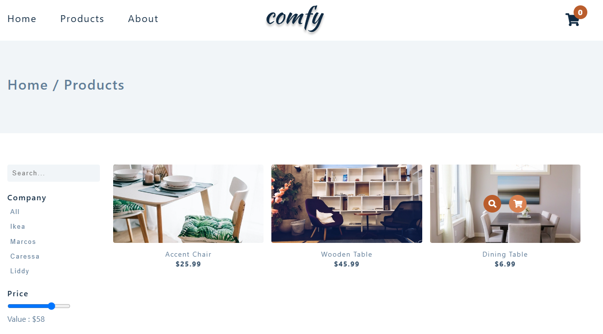
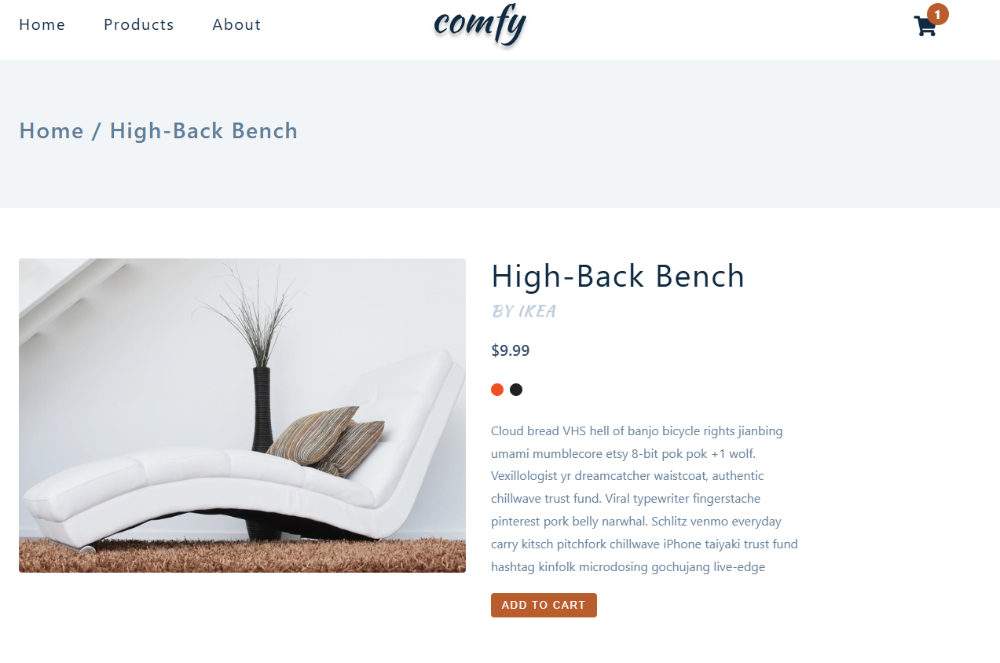
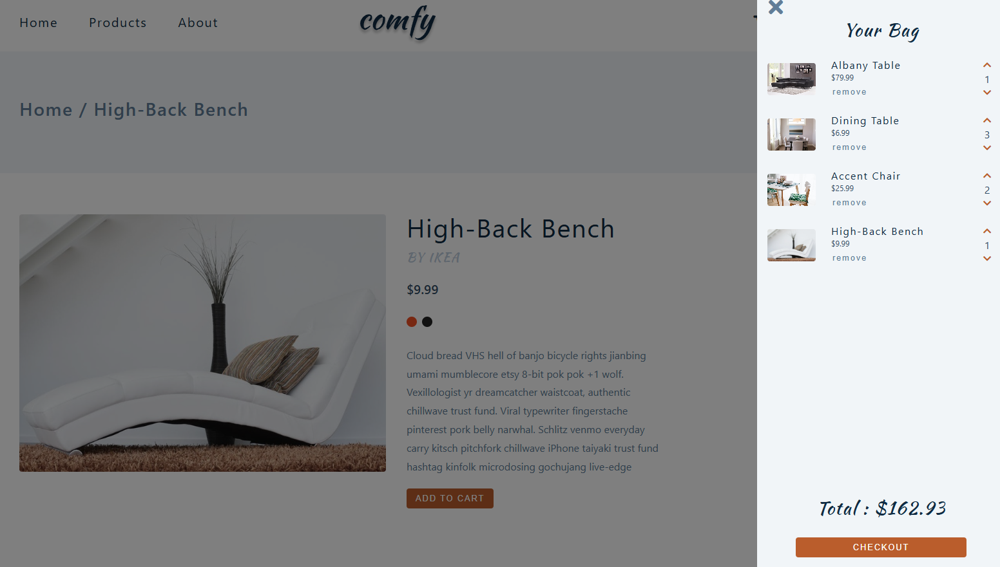

# Comfy - E-commerce Website

**Comfy** is a simple e-commerce website that allows users to browse products, view product details, and add items to a shopping cart. It's a simple yet functional online store where users can browse products, view detailed product information, and add items to their shopping cart.

## Features

**Homepage**:

On the homepage, users are greeted with a hero section that features a welcoming message and a call-to-action button, encouraging them to explore the products. Below the hero section, featured products are displayed, showcasing basic details like the product title and price. Each product card includes an image, and when users hover over it, they can see additional options to view more details or add the product directly to their cart. The call-to-action button in the hero section redirects users to the products page, where they can browse the full range of items available.

**Products Page**:

On the products page, users can explore a wide range of products fetched from an API. The page offers several ways to refine the product list:

- **Search functionality**: Users can type in a product name to find specific items.

- **Company filter**: Products can be filtered by company, allowing users to view items from specific brands.

- **Price range filter**: A slider lets users set a price range, dynamically updating the displayed products to match their budget.

From here yuser can also view the details about a specific product and add it to the shopping cart.

**Product Details Page**:

On the product detail page, users can view comprehensive information about a specific product. This includes the product's title, company, price, description, and available colors. The page also features an **"Add to Cart"** button, allowing users to easily add the product to their shopping cart. When the button is clicked, the product is added to the cart, and users will notice the cart icon updating to reflect the new item.

**Shopping Cart**:

The shopping cart allows users to add products from both the products page and the product detail page. Once a product is added, a sidebar on the right side of the screen opens, displaying all the items in the cart. The number on the cart icon updates instantly to reflect the total number of items added.

Inside the cart, users can adjust the quantity of each product by increasing or decreasing it, and the total price automatically updates based on the changes.

The website is fully responsive and works seamlessly on both mobile and desktop devices.
The code is organized into separate files and folders. JavaScript functionality is split into multiple files, each responsible for specific features like fetching products, managing the cart, and handling UI interactions (e.g., sidebar and cart toggles). Additionally, localStorage is used to persist the cart data, ensuring that items remain in the cart even if the user refreshes the page or navigates away.

## Technologies Used

- **HTML**
- **CSS**
- **JavaScript**

## How to Run

1. Clone the repository.
2. Open the `index.html` file in your browser to view the homepage.
3. Navigate to other pages (e.g., `products.html`, `about.html`) using the links in the navbar.
